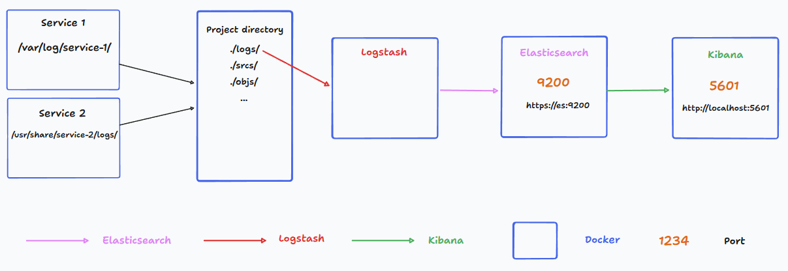

# ELK Stack

The **ELK stack** is a powerful combination of three open-source tools: **Elasticsearch**, **Logstash**, and **Kibana**. It is widely used for log analysis, time-series data, and application monitoring. In our project, the ELK stack is utilized to monitor the logs of various services.

## Components

- **Logstash**: Collects and parses logs.
- **Elasticsearch**: Indexes and stores the data.
- **Kibana**: Provides a UI to visualize the data, create dashboards, and much more.



--- 
::: warning
The goal here is not to describe and explain how these applications works but to understand how it is used in the project. We'll still provide some basic information but don't hesitate to refer to the [ELK stack documentation](https://www.elastic.co/what-is/elk-stack) for more details.
:::

## First step

First of all, we use a setup script to create certificates and keys for the ELK stack. It's necessary to  use SSL and use the security features of the stack. 

```yaml
  setup:
   image: docker.elastic.co/elasticsearch/elasticsearch:${STACK_VERSION}
   volumes:
     - certs:/usr/share/elasticsearch/config/certs
   user: "0"
   command: >
     bash -c '
       if [ x${ELASTIC_PASSWORD} == x ]; then
         echo "Set the ELASTIC_PASSWORD environment variable in the .env file";
         exit 1;
       elif [ x${KIBANA_PASSWORD} == x ]; then
         echo "Set the KIBANA_PASSWORD environment variable in the .env file";
         exit 1;
       fi;
       if [ ! -f config/certs/ca.zip ]; then
         echo "Creating CA";
         bin/elasticsearch-certutil ca --silent --pem -out config/certs/ca.zip;
         unzip config/certs/ca.zip -d config/certs;
       fi;
       if [ ! -f config/certs/certs.zip ]; then
         echo "Creating certs";
         echo -ne \
         "instances:\n"\
         "  - name: es\n"\
         "    dns:\n"\
         "      - es\n"\
         "      - localhost\n"\
         "    ip:\n"\
         "      - 127.0.0.1\n"\
         "  - name: kibana\n"\
         "    dns:\n"\
         "      - kibana\n"\
         "      - localhost\n"\
         "    ip:\n"\
         "      - 127.0.0.1\n"\
         > config/certs/instances.yml;
         bin/elasticsearch-certutil cert --silent --pem -out config/certs/certs.zip --in config/certs/instances.yml --ca-cert config/certs/ca/ca.crt --ca-key config/certs/ca/ca.key;
         unzip config/certs/certs.zip -d config/certs;
       fi;
       echo "Setting file permissions"
       chown -R root:root config/certs;
       find . -type d -exec chmod 750 \{\} \;;
       find . -type f -exec chmod 640 \{\} \;;
       echo "Waiting for Elasticsearch availability";
       until curl -s --cacert config/certs/ca/ca.crt https://es:9200 | grep -q "missing authentication credentials"; do sleep 30; done;
       echo "Setting kibana_system password";
       until curl -s -X POST --cacert config/certs/ca/ca.crt -u "elastic:${ELASTIC_PASSWORD}" -H "Content-Type: application/json" https://es:9200/_security/user/kibana_system/_password -d "{\"password\":\"${KIBANA_PASSWORD}\"}" | grep -q "^{}"; do sleep 10; done;
       echo "All done!";
     '
   healthcheck:
    test: ["CMD-SHELL", "[ -f config/certs/es/es.crt ]"]
    interval: 1s
    timeout: 5s
    retries: 120
```

You can find this script [here](https://www.elastic.co/blog/getting-started-with-the-elastic-stack-and-docker-compose) along with some additional information about the ELK stack setup. We found that healthchecks are useful to ensure that services wait for each other and start in the right order, so we deciced to keep them.

::: info

``$STACK_VERSION`` is the version of the ELK stack you want to use. You can find the available versions on the [Elastic website](https://www.elastic.co/guide/en/elasticsearch/reference/current/es-release-notes.html).
We recommend using the version you are most comfortable with, as it depends on the documentation you are following.
:::